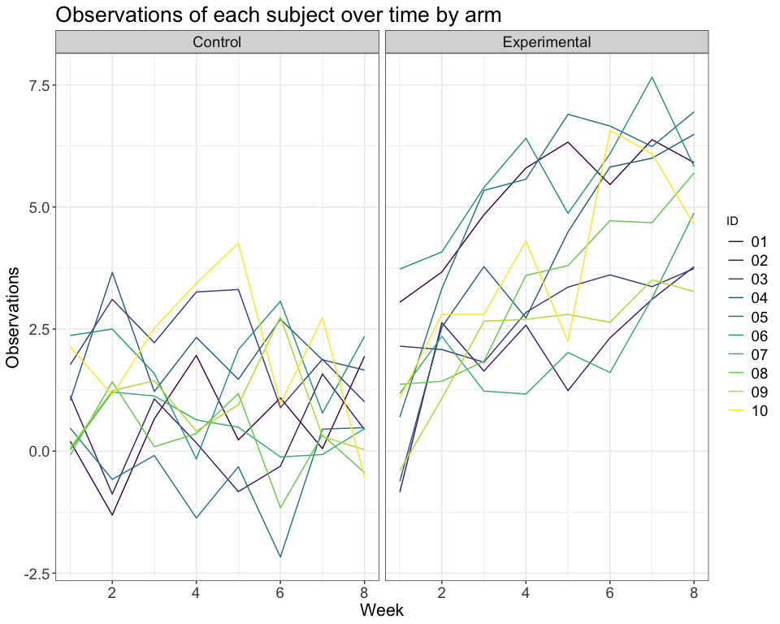

Homework 5
================
Ashley Kang

### Problem 1

##### Create a tidy dataframe containing data from all participants, including the subject ID, arm, and observations over time:

Start with a dataframe containing all file names; the `list.files` function will help. Iterate over file names and read in data for each subject using `purrr::map` and saving the result as a new variable in the dataframe

``` r
df_1 =
  tibble(filenames = list.files("data", full.names = TRUE), map(filenames, read_csv)) %>% 
  unnest() %>% 
  separate(filenames, into = c("arm", "id"), sep = "_") %>%
  mutate(arm = str_remove(arm, "data/"), id = str_remove(id, ".csv")) %>% 
  mutate(arm = recode(arm, "'con' = 'Control'; 'exp' = 'Experimental'"))
```

Tidy the result; manipulate file names to include control arm and subject ID, make sure weekly observations are “tidy”, and do any other tidying that’s necessary

``` r
tidy_df = df_1 %>% 
  gather(key = week, value = value, "week_1":"week_8") %>% 
  mutate(week = str_remove(week, "week_")) %>% 
  mutate(week = as.numeric(week))  %>%
  arrange(week, id)
```

##### Spaghetti plot

``` r
ggplot(tidy_df, aes(week, value, group = id, color = id)) +
  geom_line() +
  facet_grid(~ arm) +
  labs(title = "Observations of each subject over time by arm",
       x = "Week",
       y = "Observations") +
  viridis::scale_color_viridis(name = "ID", discrete = TRUE) +
  theme_bw() +
  theme(axis.title = element_text(size = 16), 
        axis.text = element_text(size = 14), 
        plot.title = element_text(size = 20), 
        strip.text.x = element_text(size = 14), 
        legend.text = element_text(size = 14)
        )
```



The spaghetti plot shows that individuals assigned to the control arm appear to remain constant across the study period while individuals assigned to the experimental arm appear to have increasing observation values.
