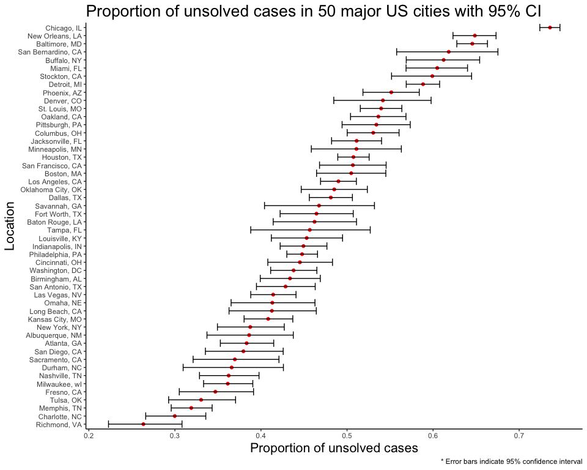

Homework 5
================
Ashley Kang

### Problem 1

##### Create a tidy dataframe containing data from all participants, including the subject ID, arm, and observations over time:

Start with a dataframe containing all file names; the `list.files` function will help. Iterate over file names and read in data for each subject using `purrr::map` and saving the result as a new variable in the dataframe

``` r
df_1 =
  tibble(filenames = list.files("data", full.names = TRUE), map(filenames, read_csv)) %>% 
  unnest() %>% 
  separate(filenames, into = c("arm", "id"), sep = "_") %>%
  mutate(arm = str_remove(arm, "data/"), id = str_remove(id, ".csv")) %>% 
  mutate(arm = recode(arm, "'con' = 'Control'; 'exp' = 'Experimental'"))
```

Tidy the result; manipulate file names to include control arm and subject ID, make sure weekly observations are “tidy”, and do any other tidying that’s necessary

``` r
tidy_df = df_1 %>% 
  gather(key = week, value = value, "week_1":"week_8") %>% 
  mutate(week = str_remove(week, "week_")) %>% 
  mutate(week = as.numeric(week))  %>%
  arrange(week, id)
```

##### Spaghetti plot

``` r
ggplot(tidy_df, aes(week, value, group = id, color = id)) +
  geom_line() +
  facet_grid(~ arm) +
  labs(title = "Observations of each subject over time by arm",
       x = "Week",
       y = "Observations") +
  viridis::scale_color_viridis(name = "ID", discrete = TRUE) +
  theme_bw() +
  theme(axis.title = element_text(size = 16), 
        axis.text = element_text(size = 14), 
        plot.title = element_text(size = 20), 
        strip.text.x = element_text(size = 14), 
        legend.text = element_text(size = 14)
        )
```


The spaghetti plot shows that individuals assigned to the control arm appear to remain constant across the study period while individuals assigned to the experimental arm appear to have increasing observation values.

### Problem 2

##### *The Washington Post* has gathered data on homicides in 50 large U.S. cities and made the data available through a GitHub repository.

Describe the raw data.

``` r
homicide_data = 
  read_csv("https://raw.githubusercontent.com/washingtonpost/data-homicides/master/homicide-data.csv") %>% 
  janitor::clean_names()
```

*The Washington Post* homicide dataset contains information on **52179 homicides** from 2007 to 2015 across 50 major U.S. cities. There are **12 variables**, which provide information on the the victim's name, age, sex, race, reported date of homicide, location of homicide, and whether or not the case was solved. The data seems to be tidy.

Create a `city_state` variable (e.g. “Baltimore, MD”) and then summarize within cities to obtain the total number of homicides and the number of unsolved homicides (those for which the disposition is “Closed without arrest” or “Open/No arrest”).

``` r
grouped_homicide = homicide_data %>%
  unite("city_state", c("city", "state"), sep = ", ") %>% 
  mutate(disposition = recode(disposition, "'Closed without arrest' = 'unsolved'; 'Open/No arrest' = 'unsolved'; 'Closed by arrest' = 'solved'")) %>%
  mutate(city_state = recode(city_state, "'Tulsa, AL' = 'Tulsa, OK'")) %>% 
  group_by(city_state) %>% 
  summarize(total = n(), unsolved = sum(disposition == "unsolved"))
```

For the city of Baltimore, MD, use the `prop.test` function to estimate the proportion of homicides that are unsolved; save the output of prop.test as an R object, apply the `broom::tidy` to this object and pull the estimated proportion and confidence intervals from the resulting tidy dataframe.

``` r
homicide_baltimore = grouped_homicide %>% 
  filter(city_state == 'Baltimore, MD')

prop_balitmore = broom::tidy(prop.test(homicide_baltimore$unsolved, homicide_baltimore$total))

knitr::kable(prop_balitmore, col.names = c("Estimate",
                           "Statistic",
                           "P-value",
                           "Parameter",
                           "Lower bound",
                           "Upper bound",
                           "Method",
                           "Alternative"))
```

|   Estimate|  Statistic|  P-value|  Parameter|  Lower bound|  Upper bound| Method                                               | Alternative |
|----------:|----------:|--------:|----------:|------------:|------------:|:-----------------------------------------------------|:------------|
|  0.6455607|    239.011|        0|          1|    0.6275625|    0.6631599| 1-sample proportions test with continuity correction | two.sided   |

The estimated proportion of unsolved cases in Baltimore, MD is 64.6% of all homicide cases (95% CI: 62.8%, 66.3%).

Now run prop.test for each of the cities in your dataset, and extract both the proportion of unsolved homicides and the confidence interval for each. Do this within a “tidy” pipeline, making use of `purrr::map`, `purrr::map2`, list columns and unnest as necessary to create a tidy dataframe with estimated proportions and CIs for each city.

``` r
prop_homicides = grouped_homicide %>% 
  mutate(homicides = map2(unsolved, total, ~broom::tidy(prop.test(.x, .y)))) %>% 
  unnest() %>% 
  select(city_state:estimate, conf.low:conf.high) %>% 
  janitor::clean_names()

knitr::kable(prop_homicides, col.names = c("City, State",
                           "Total",
                           "Unsolved",
                           "Estimate",
                           "Lower bound",
                           "Upper bound"))
```

| City, State        |  Total|  Unsolved|   Estimate|  Lower bound|  Upper bound|
|:-------------------|------:|---------:|----------:|------------:|------------:|
| Albuquerque, NM    |    378|       146|  0.3862434|    0.3372604|    0.4375766|
| Atlanta, GA        |    973|       373|  0.3833505|    0.3528119|    0.4148219|
| Baltimore, MD      |   2827|      1825|  0.6455607|    0.6275625|    0.6631599|
| Baton Rouge, LA    |    424|       196|  0.4622642|    0.4141987|    0.5110240|
| Birmingham, AL     |    800|       347|  0.4337500|    0.3991889|    0.4689557|
| Boston, MA         |    614|       310|  0.5048860|    0.4646219|    0.5450881|
| Buffalo, NY        |    521|       319|  0.6122841|    0.5687990|    0.6540879|
| Charlotte, NC      |    687|       206|  0.2998544|    0.2660820|    0.3358999|
| Chicago, IL        |   5535|      4073|  0.7358627|    0.7239959|    0.7473998|
| Cincinnati, OH     |    694|       309|  0.4452450|    0.4079606|    0.4831439|
| Columbus, OH       |   1084|       575|  0.5304428|    0.5002167|    0.5604506|
| Dallas, TX         |   1567|       754|  0.4811742|    0.4561942|    0.5062475|
| Denver, CO         |    312|       169|  0.5416667|    0.4846098|    0.5976807|
| Detroit, MI        |   2519|      1482|  0.5883287|    0.5687903|    0.6075953|
| Durham, NC         |    276|       101|  0.3659420|    0.3095874|    0.4260936|
| Fort Worth, TX     |    549|       255|  0.4644809|    0.4222542|    0.5072119|
| Fresno, CA         |    487|       169|  0.3470226|    0.3051013|    0.3913963|
| Houston, TX        |   2942|      1493|  0.5074779|    0.4892447|    0.5256914|
| Indianapolis, IN   |   1322|       594|  0.4493192|    0.4223156|    0.4766207|
| Jacksonville, FL   |   1168|       597|  0.5111301|    0.4820460|    0.5401402|
| Kansas City, MO    |   1190|       486|  0.4084034|    0.3803996|    0.4370054|
| Las Vegas, NV      |   1381|       572|  0.4141926|    0.3881284|    0.4407395|
| Long Beach, CA     |    378|       156|  0.4126984|    0.3629026|    0.4642973|
| Los Angeles, CA    |   2257|      1106|  0.4900310|    0.4692208|    0.5108754|
| Louisville, KY     |    576|       261|  0.4531250|    0.4120609|    0.4948235|
| Memphis, TN        |   1514|       483|  0.3190225|    0.2957047|    0.3432691|
| Miami, FL          |    744|       450|  0.6048387|    0.5685783|    0.6400015|
| Milwaukee, wI      |   1115|       403|  0.3614350|    0.3333172|    0.3905194|
| Minneapolis, MN    |    366|       187|  0.5109290|    0.4585150|    0.5631099|
| Nashville, TN      |    767|       278|  0.3624511|    0.3285592|    0.3977401|
| New Orleans, LA    |   1434|       930|  0.6485356|    0.6231048|    0.6731615|
| New York, NY       |    627|       243|  0.3875598|    0.3494421|    0.4270755|
| Oakland, CA        |    947|       508|  0.5364308|    0.5040588|    0.5685037|
| Oklahoma City, OK  |    672|       326|  0.4851190|    0.4467861|    0.5236245|
| Omaha, NE          |    409|       169|  0.4132029|    0.3653146|    0.4627477|
| Philadelphia, PA   |   3037|      1360|  0.4478103|    0.4300380|    0.4657157|
| Phoenix, AZ        |    914|       504|  0.5514223|    0.5184825|    0.5839244|
| Pittsburgh, PA     |    631|       337|  0.5340729|    0.4942706|    0.5734545|
| Richmond, VA       |    429|       113|  0.2634033|    0.2228571|    0.3082658|
| Sacramento, CA     |    376|       139|  0.3696809|    0.3211559|    0.4209131|
| San Antonio, TX    |    833|       357|  0.4285714|    0.3947772|    0.4630331|
| San Bernardino, CA |    275|       170|  0.6181818|    0.5576628|    0.6753422|
| San Diego, CA      |    461|       175|  0.3796095|    0.3354259|    0.4258315|
| San Francisco, CA  |    663|       336|  0.5067873|    0.4680516|    0.5454433|
| Savannah, GA       |    246|       115|  0.4674797|    0.4041252|    0.5318665|
| St. Louis, MO      |   1677|       905|  0.5396541|    0.5154369|    0.5636879|
| Stockton, CA       |    444|       266|  0.5990991|    0.5517145|    0.6447418|
| Tampa, FL          |    208|        95|  0.4567308|    0.3881009|    0.5269851|
| Tulsa, OK          |    584|       193|  0.3304795|    0.2927201|    0.3705039|
| Washington, DC     |   1345|       589|  0.4379182|    0.4112495|    0.4649455|

Create a plot that shows the estimates and CIs for each city – check out geom\_errorbar for a way to add error bars based on the upper and lower limits. Organize cities according to the proportion of unsolved homicides.

``` r
prop_homicides %>% 
  mutate(city_state = fct_reorder(city_state, estimate)) %>% 
  ggplot(aes(x = city_state, y = estimate)) + 
  geom_point(color = "red") + 
  geom_errorbar(aes(ymin = conf_low, ymax = conf_high)) + 
  coord_flip() + 
  labs(title = "Proportion of unsolved cases in 50 major US cities with 95% CI", 
       y = "Proportion of unsolved cases", 
       x = "Location",
       caption = "* Error bars indicate 95% confidence interval") + 
  theme_classic() +
  theme(axis.title = element_text(size = 16), 
        plot.title = element_text(size = 20)
        ) 
```



The resulting plot shows the estimated proportion of unsolved homicide cases in each of the 50 cities with a corresponding 95% confidence interval. Chicago has the highest proportion of unsolved cases (which is considerably higher than the rest of the cities), while Richmond has the lowest proportion of unsolved cases.
